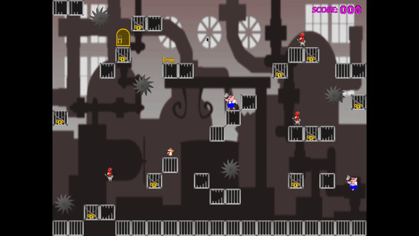

# Mad Meat Rampage
Mad Meat Rampage is a silly, boring and buggy game. You have been warned.

## Screens

## How to Run
#### On Linux (and maybe macOS):
1. Install [SFML](https://www.sfml-dev.org)
1. `cd mad-meat-rampage` (or whatever name you use for the root directory of the application)
1.  `make`
1. To run:
   1. Fullscreen mode: `bin/mmr`
   1. Windowed mode: `bin/mmr -w`

#### On Windows:
1.  Install a Linux distribution
1.  See above
1.  Joke. Well, not really. See [this](docs/Installing.md#windows).

## How to Play
So this midget man made his fortune slaughtering kind animals to sell bacon and nuggets. The animals have had enough, and now they want revenge.

Right you just want to know how to actually play, I get it. Use the arrow keys to move and jump (you can also move in midair). The mad pigs and chickens will try to kill you no matter what (yes, you're the midget guy). They will go straight to the traps found across the level, so you can use this to your advantage (the traps will kill you too though, avoid them). There will be a key somewhere in the level, you have to pick it up and take it to the door, and then the next level will load.

## Ok But...
#### I am seeing the same levels again. When the game ends?
Never. When you beat all the levels, they start again. You keep your score though.

#### There are too few levels.
You can easily create more! Files under [data](data) can be modified to create new levels and/or change existing ones! Take a look [here](docs/Editing.md#levels).

#### Your "art" is UGLY, I can't stand it.
Understandable. Good news though: you can replace it with yours! As with levels, the textures can be changed. Read [this](docs/Editing.md#textures-and-animations).

#### This damn pig is too FAST!
Yeah, there is no limit to how much it can accelerate. Character attributes like speed can be changed just like levels and textures. [Here's how to do it](docs/Editing.md#characters-and-objects).

#### I think I found a bug.
I am sure you did.

#### I will fix this nasty bug.
Please, do it. And thank you.

#### This piece of software exploded my computer!
Oh. Sorry. You can fill an issue [here](https://github.com/gviegas/mad-meat-rampage/issues) so we can look into it.

## License
Unless otherwise mentioned, the source code of this project is licensed under the [MIT License](LICENSE.md).

The game textures/images are licensed under the terms of the [Creative Commons Attribution 4.0 International License](https://creativecommons.org/licenses/by/4.0/).

See also [Credits](docs/Credits.md).
